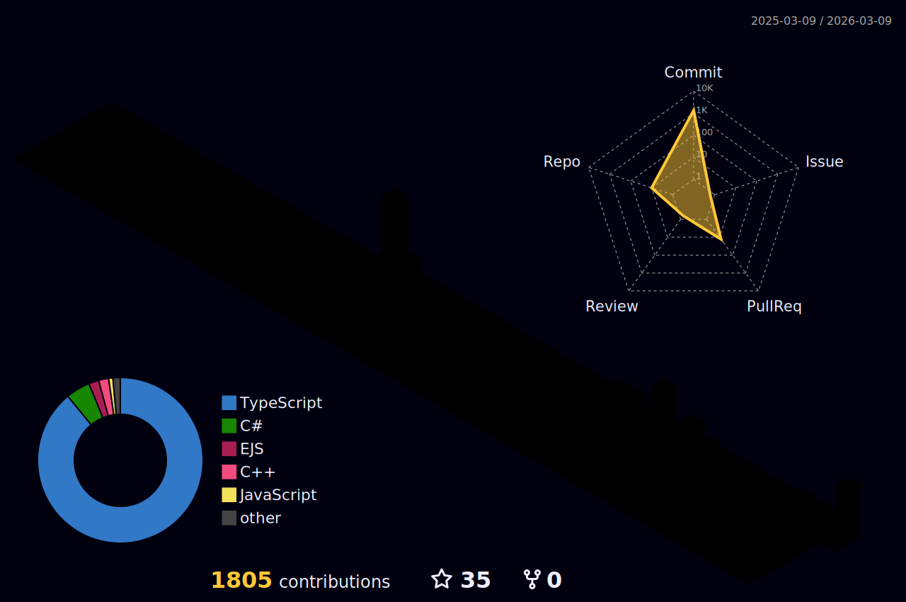

[](https://git.io/typing-svg)

```text
 .----------------.   .----------------.   .----------------.   .----------------.   .----------------.   .---------------.
| .--------------. | | .--------------. | | .--------------. | | .--------------. | | .--------------. | | .-------------. |
| |  _______     | | | |  _________   | | | |      __      | | | |  _________   | | | | ____    ____ | | | |  _________  | |
| | |_   __ \    | | | | |_   ___  |  | | | |     /  \     | | | | |   ____  \  | | | ||_   \  /   _|| | | | |_   ___  | | |
| |   | |__) |   | | | |   | |_  \_|  | | | |    / /\ \    | | | | |  |    \ |  | | | |  |   \/   |  | | | |   | |_  \_| | |
| |   |  __ /    | | | |   |  _|  _   | | | |   / ____ \   | | | | |  |    |  | | | | |  | |\  /| |  | | | |   |  _|  _  | |
| |  _| |  \ \_  | | | |  _| |___/ |  | | | | _/ /    \ \_ | | | | |  |____/ |  | | | | _| |_\/_| |_ | | | |  _| |___/ | | |
| | |____| |___| | | | | |_________|  | | | ||____|  |____|| | | | |_________/  | | | ||_____||_____|| | | | |_________| | |
| |              | | | |              | | | |              | | | |              | | | |              | | | |             | |
| '--------------' | | '--------------' | | '--------------' | | '--------------' | | '--------------' | | '-------------' |
 '----------------'   '----------------'   '----------------'   '----------------'   '----------------'   '---------------'
============================================================================================================================
|                                                        About Me                                                          |
============================================================================================================================
```
<div align="left">
  <table border="0" cellspacing="0" cellpadding="0" style="border: none; border-collapse: collapse;">
    <tr style="border: none;">
      <td height="55.00%" style="border: none; padding: 10px; text-align: center; display: flex; flex-direction: column; justify-content: center;">
        <ul>
          <li><b>Bacharel em Ciência da Computação</b>
            <ul>
              <li>Faculdade Adamantinense Integrada (FAI)</li>
            </ul>
          </li>
          <li><b>Técnico em Redes de Computadores e Infraestrutura</b>
            <ul>
              <li>Etec Prof. Eudécio Luiz Vicente - Centro Paula Souza</li>
            </ul>
          </li>
        </ul>
      </td>
      <td height="45.00%" style="border: none; padding: 10px; text-align: center; display: flex; flex-direction: column; justify-content: center;">
          <a href="https://www.instagram.com/malheirosan" target="_blank"></a>
          <a href="https://discord.com/users/1347413134205517894" target="_blank"></a>
          <a href="https://t.me/unkandata" target="_blank"></a>
          <a href="https://www.linkedin.com/in/SEU-USUARIO-AQUI" target="_blank"></a>
      </td> 
    </tr>
  </table>
</div>

<!--START_SECTION:waka-->
<!--END_SECTION:waka-->

```text
   .----------------------------------------------------------------------------------------------------------------------.
  | /   \                                                                                                           /   \ |
 | | .-. |                                                                                                         | .-. | |
 | | | | |                                 ♫    S K I L L S,  S T A T S  &  M U S I C    ⚙                         | || | |
 | | '-' |                                                                                                         | '-' | |
  | \   /                                                                                                           \   / |
   '----------------------------------------------------------------------------------------------------------------------'
```
<div align="center">
  <table border="0" cellspacing="0" cellpadding="0" style="border: none; border-collapse: collapse;">
    <tr style="border: none;">
      <td style="border: none; vertical-align: top; ">
        
        <br> 
        
      </td>
      <td style="border: none; vertical-align: top; ">
        
      </td> 
      <td style="border: none; vertical-align: top; ">
        
        <br>
        
      </td>
    </tr>
  </table>
</div>

```text
o--------------------------------------------------------------------------------------------------------------------------o
|  [+]                                                                                                                [+]  |
|  [+]                                        T O O L I N G   &   A B I L I T I E S                                   [+]  |
|  [+]                                                                                                                [+]  |
o--------------------------------------------------------------------------------------------------------------------------o
```
<div align="center">
  <table border="0" cellspacing="0" cellpadding="0" style="border: none; border-collapse: collapse; height: 100%;">
    <tr style="border: none;">
      <td width="21.33%" style="border: none; text-align: center; display: flex; flex-direction: column; justify-content: center;">
        <div align="center">
          <h4>Programming Languages</h4>
          
        </div>
        <div align="center" style="margin-top: 20px;">
          <h4>Web & Backend Development</h4>
          
        </div>
      </td>
      <td width="33.33%" style="border: none; text-align: center; display: flex; flex-direction: column; justify-content: center;">
        <div align="center">
          
          
        </div>
      </td>
      <td width="21.33%" style="border: none; text-align: center; display: flex; flex-direction: column; justify-content: center;">
        <div align="center">
          <h4>Tools & Platforms</h4>
          
        </div>
        <div align="center" style="margin-top: 20px;">
          <h4>Other Skills</h4>
          
        </div>
      </td>
    </tr>
  </table>
</div>

```text
<//////////////////////////////////////////////////////////////////////////////////////////////////////////////////////////>
|                                                                                                                          |
|                                           K N O W L E D G E   O F   L A N G U A G E S                                    |
|                                                                                                                          |
<//////////////////////////////////////////////////////////////////////////////////////////////////////////////////////////>
```
<div align="center">
    
</div>

<p align="center">
  <picture>
    <source media="(prefers-color-scheme: dark)" srcset="https://raw.githubusercontent.com/antoniomalheirs/antoniomalheirs/output/github-contribution-grid-snake-dark.svg">
    <source media="(prefers-color-scheme: light)" srcset="https://raw.githubusercontent.com/antoniomalheirs/antoniomalheirs/output/github-contribution-grid-snake.svg">
    
  </picture>
</p>

```text
   ______________________________________________________________________________________________________________________
 /     _______________________________________________________________________________________________________________    \ 
|   //                                                                                                                |    |
|  |                                S O M E   I N T E R E S T I N G   R E P O S I T O R I E S                         |    |
|  |_________________________________________________________________________________________________________________/     |
 \________________________________________________________________________________________________________________________/
```

<div align="center">
<a href="https://github.com/antoniomalheirs/Discord_MusicBot"></a>
<a href="https://github.com/antoniomalheirs/Hotel_manager_basic"></a>
<br><br>
<a href="https://github.com/antoniomalheirs/Pokedex_Android_API_APP"></a>
<a href="https://github.com/antoniomalheirs/Clippy_Revenge"></a>
</div>


