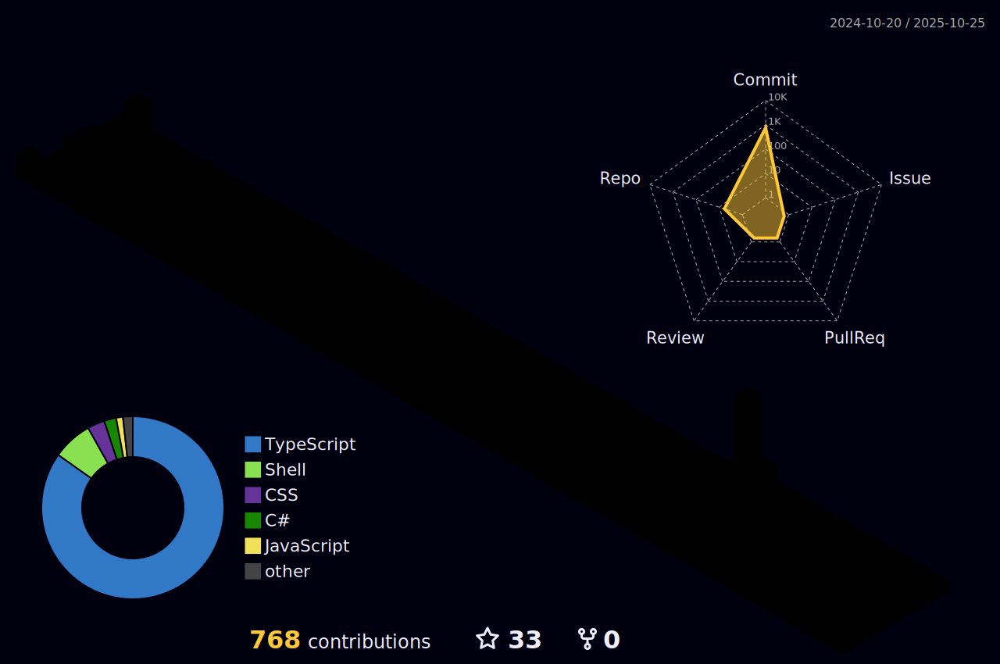

[](https://git.io/typing-svg)

```text
========================================================================================================================
|                                                       About Me                                                       |
========================================================================================================================
```
<p align="center">
  Graduated in Computer Science from Faculdade Adamantinense Integrada - FAI, Technician in Computer Networks/Infras from Etec Prof. Eudécio Luiz Vicente - Center Paula Souza.
</p>

<!--START_SECTION:waka-->
<!--END_SECTION:waka-->

```text
+----------------------------------------------------------------------------------------------------------------------+
|                                       ♫   S k i l l s ,   S t a t s   &   M u s i c   ⚙                            |
+----------------------------------------------------------------------------------------------------------------------+
```

<div align="center">
  <table border="0" cellspacing="0" cellpadding="0" style="border: none; border-collapse: collapse;">
    <tr style="border: none;">
      <td style="border: none; vertical-align: top; padding-right: 10px;">
        
        <br> 
        
      </td>
      <td style="border: none; vertical-align: top; padding-right: 10px;">
        
        <br>
        
      </td>
      <td style="border: none; vertical-align: top; padding-left: 10px;">
        
      </td>
    </tr>
  </table>
</div>

```text
o----------------------------------------------------------------------------------------------------------------------o
|                                                  Tooling & Abilities                                                 |
o----------------------------------------------------------------------------------------------------------------------o
```

<div align="center">
  <table border="0" cellspacing="0" cellpadding="0" style="border: none; border-collapse: collapse;">
    <tr style="border: none;">
      <td style="border: none; vertical-align: top; padding: 0 10px;">
        
      </td>
      <td style="border: none; vertical-align: top; padding: 0 10px;">
        
      </td>
    </tr>
  </table>
</div>

```text
<//>--------------------------------------------- Knowledge of Languages -------------------------------------------<\/>
```

<div align="center">
    
</div>

<p align="center">
  <picture>
    <source media="(prefers-color-scheme: dark)" srcset="https://raw.githubusercontent.com/antoniomalheirs/antoniomalheirs/output/github-contribution-grid-snake-dark.svg">
    <source media="(prefers-color-scheme: light)" srcset="https://raw.githubusercontent.com/antoniomalheirs/antoniomalheirs/output/github-contribution-grid-snake.svg">
    
  </picture>
</p>

```text
+=-=-=-=-=-=-=-=-=-=-=-=-=-=-=-=-=-=-=-=-=-=-=-=-=-=-=-=-=-=-=-=-=-=-=-=-=-=-=-=-=-=-=-=-=-=-=-=-=-=-=-=-=-=-=-=-=-=-=-+
|                                              Some interesting repositories                                           |
+=-=-=-=-=-=-=-=-=-=-=-=-=-=-=-=-=-=-=-=-=-=-=-=-=-=-=-=-=-=-=-=-=-=-=-=-=-=-=-=-=-=-=-=-=-=-=-=-=-=-=--=-=-==-=-=-=-=-+
```

<div align="center">
<a href="https://github.com/antoniomalheirs/Hotel_manager_basic"></a>
<a href="https://github.com/antoniomalheirs/Assault_Cube_Trainer"></a>
<br><br>
<a href="https://github.com/antoniomalheirs/Unity_basic_game"></a>
<a href="https://github.com/antoniomalheirs/Windows10-11-Reverse_Shell"></a>
</div>


